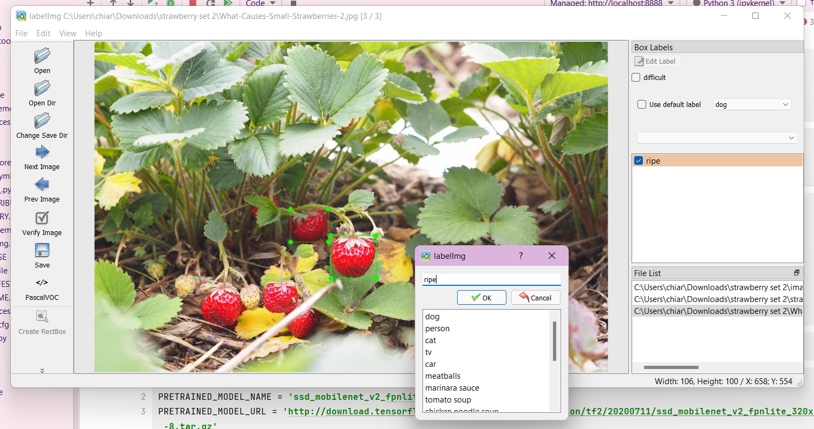
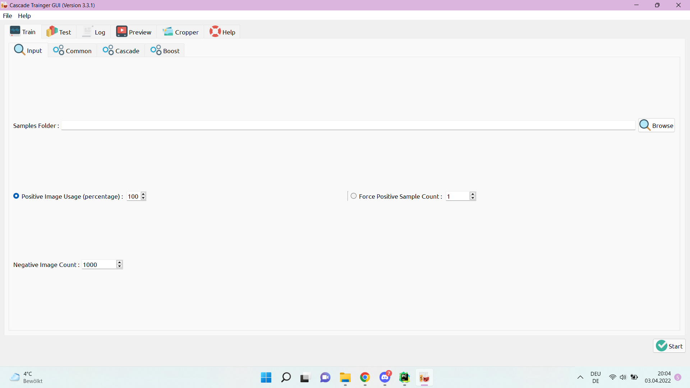

# Object Detection through Models

## Tensorflow

The first steps of creating a Model for object Detection
is to collect enough **labelled** Data for the Model's accuracy to be good enough.

### Setting Up Data

After having collected enough Data for the Model to be considered well-trained.

> For each label you must have at least 10 images, each with at least one annotation (bounding box and the label). However, for model training purposes it's recommended you use about 1000 annotations per label. In general, the more images per label you have the better your model will perform.

In our Case we have only one label: **ripe**. Which means we have to collect around 1000
good images of ripe strawberries (enough shapes, angles, etc.)

For all of these images to become use-able we have to label them. Labelling an object
means that we have to **mark** and **name** them in a static image.

### Labelling Objects

To Label objects in an image I used the Program **LabelImg**.

     To open this application go to the Untitles Jupyter Notebook File
     in your IDE and run the Code snippets 12, 14 and 15.

After labelling an image make sure to save it - otherwise the label on the object 
will not be saved.

### Training the Model

< *Explanation will follow > 

## Cascade

The first step of creating a Model for object detection with Cascade
is (as well as with Tensorflow). 

### Collecting Data 

In the case of Cascade there is no need to actually label the data. All we have to
do is collect **enough** positive and negative Data.

- **positive** Data: Images actually showing the object we want to detect
- **negative** Data: Images **NOT** showing the object we want to detect

You have to collect all the data in one folder and create two sub folders
- **n** for negative data
- **p** for positive data

### Training the Model

To train the Model we use the Application **Cascade Trainer GUI**.

< *more Explanation will follow* > 

